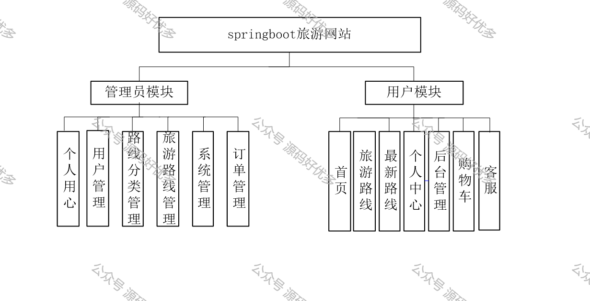
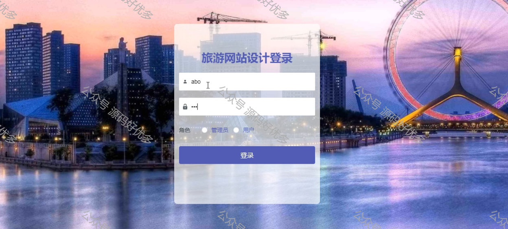
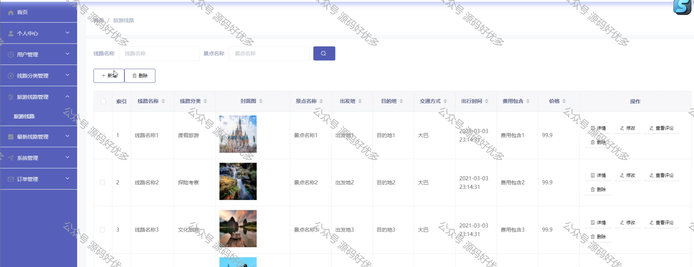
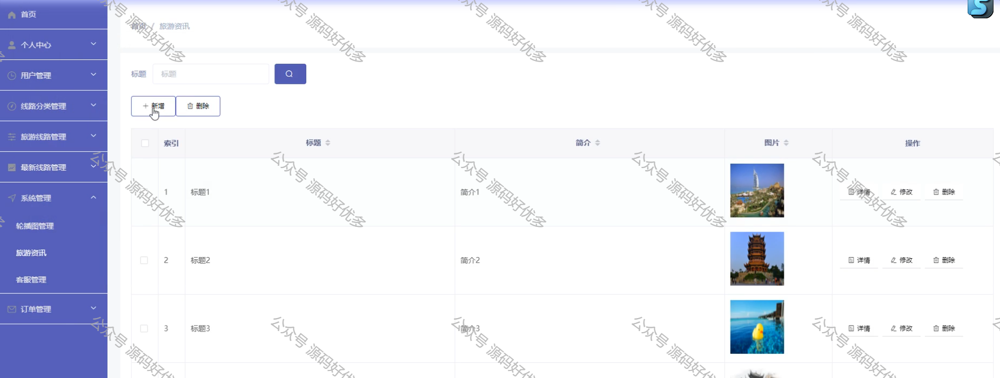
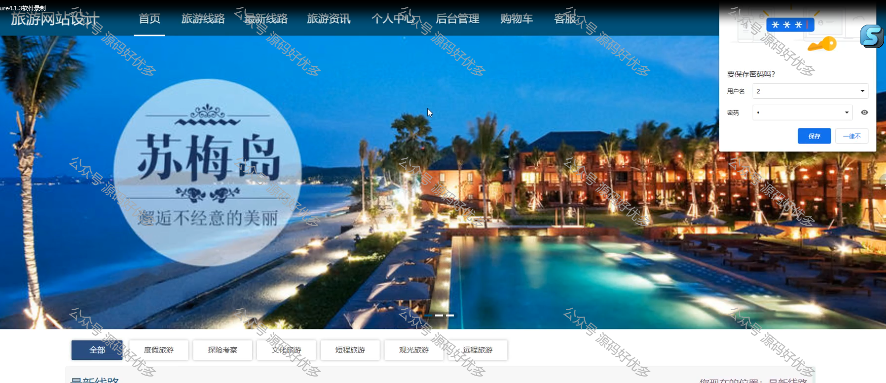
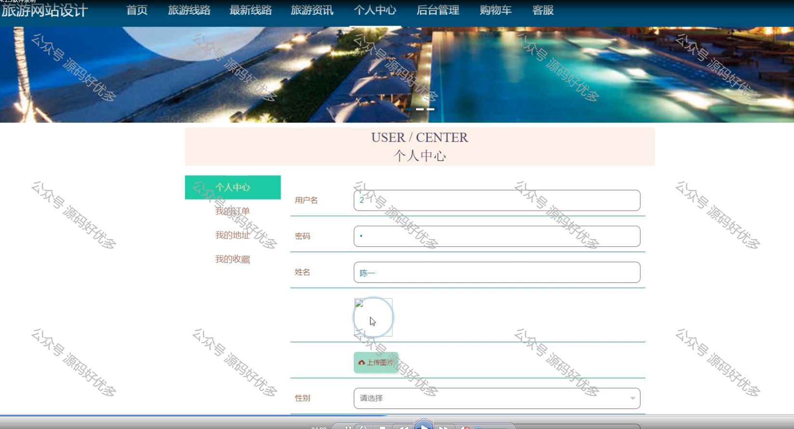
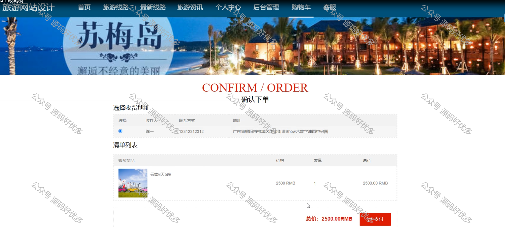
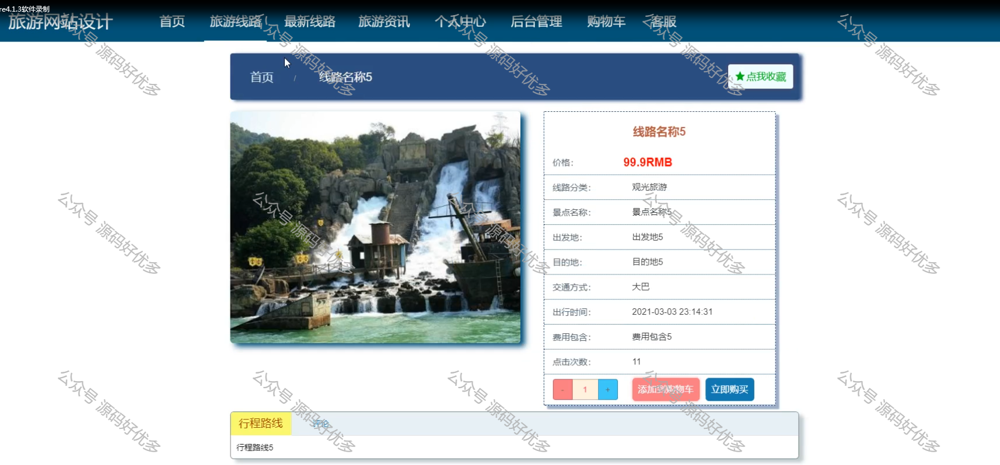
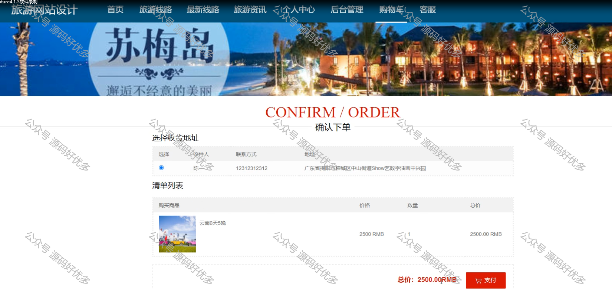

 
## 查看主页获取源码

> **作者介绍**： **✌**全网粉丝10W+本平台特邀作者、博客专家、CSDN新星计划导师、java领域优质创作者,博客之星、掘金/华为云/阿里云/InfoQ等平台优质作者、专注于毕业项目实战 **✌**

  

### 一、作品包含

源码+数据库+设计文档万字LW+PPT+全套环境和工具资源+部署教程

### 二、项目技术

前端技术：Html、Css、Js、Vue、Element-ui

数据库：MySQL

后端技术：Java、Spring Boot、MyBatis

  

### 三、运行环境

开发工具：IDEA/eclipse

数据库：MySQL8.0

数据库管理工具：Navicat10以上版本

环境配置软件： JDK1.8+Maven3.6.3

前端Nodejs：14

  

### 四、项目介绍

项目编号：springboot013

随着科学技术的飞速发展，各行各业都在努力与现代先进技术接轨，通过科技手段提高自身的优势，旅游网站当然也不能排除在外，随着旅游网站的不断成熟，它彻底改变了过去传统的旅游网站方式，不仅使旅游管理难度变低了，还提升了旅游网站的灵活性。这种个性化的旅游网站特别注重交互协调经营与管理的相互配合，激发了管理人员的创造性与主动性，对旅游管理的管理而言非常有利。
本文首先分析了旅游网站的发展背景和意义，简要阐述了旅游网站系统开发的主要内容和优势，然后简要介绍了国内外旅游网站系统的研究和应用现状，并对系统开发技术，系统分析和总体设计，实现详细功能等。
本旅游网站系统采用的数据库是MYSQL，使用JSP技术开发，在设计过程中，充分保证了系统代码的良好可读性、实用性、易扩展性、通用性、便于后期维护、操作方便以及页面简洁等特点。

### 五、运行截图

  
